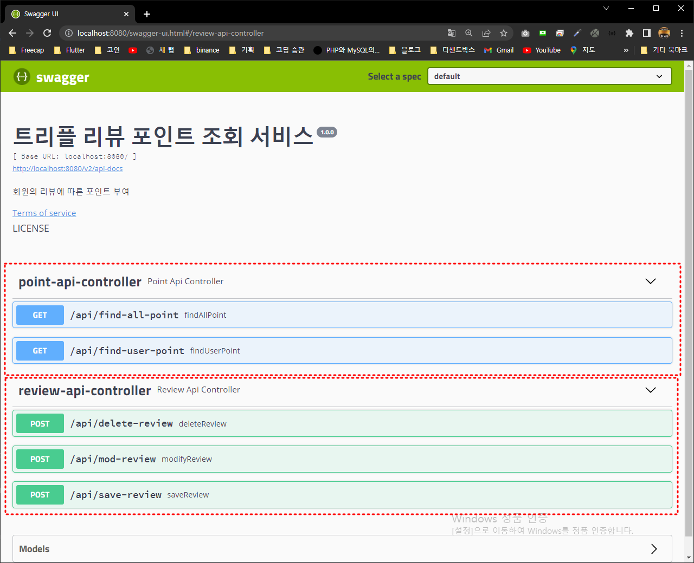

# 트리플 사전과제 - 트리플여행자 클럽 마일리지 서비스

## 목차
[1. 개발환경](#개발환경)

[2. 빌드 및 실행하기](#빌드-및-실행하기)

[3. 기능 요구사항](#기능-요구사항)

[4. 리뷰 작성 방법](#리뷰-작성-방법)

-----------------------
## 개발환경
* 기본환경
  * IDE: Intellij IDEA
  * OS: window10
  * GIT
* Server
  * java11
  * Spring Boot 2.7.0
  * JPA
  * MYSQL
  * Gradle
  * junit5
---
## 빌드 및 실행하기
### 터미널 환경
* Git, JAVA는 설치되었다고 가정
```
$ git clone https://github.com/qkrxodud/triple.git
$ cd triple
$ ./gradlew clean build
$ java -jar build/libs/review-0.0.1-SNAPSHOT.jar
```
---
## 데이터 베이스 설정
sql > DDL.sql 파일 참조
```mysql
-- 계정 생성
-- 계정 생성
CREATE USER 'triple'@'localhost' identified BY '1q2w3e4r!';
-- 권한 설정
GRANT ALL PRIVILEGES ON *.* TO 'triple'@'localhost';
flush PRIVILEGES;
-- 비밀번호 형식 변경
ALTER user 'triple'@'localhost' IDENTIFIED WITH mysql_native_password by '1q2w3e4r!';
-- 데이터베이스 생성
CREATE DATABASE triple;


-- 첨부파일 테이블 생성
CREATE TABLE `attachment`  (
                             `seq` INTEGER NOT NULL AUTO_INCREMENT PRIMARY KEY,
                             `review_id` bigint DEFAULT NULL COMMENT '리뷰 ID',
                             `file_uuid` varchar(255) DEFAULT NULL COMMENT '파일 UUID',
                             INDEX `idx_1_attachment_1` (`seq`),
                             INDEX `idx_2_attachment_2` (`seq`,`review_id`)
)  COMMENT = '첨부파일' ENGINE=INNODB;

-- 리뷰 테이블 생성
CREATE TABLE `review` (
                        `seq` bigint NOT NULL AUTO_INCREMENT PRIMARY KEY,
                        `review_uuid` varchar(255) DEFAULT NULL COMMENT '리뷰 UUID',
                        `user_uuid` varchar(255) DEFAULT NULL COMMENT '유저 UUID',
                        `place_uuid` varchar(255) DEFAULT NULL COMMENT '장소 UUID',
                        `status` varchar(255) DEFAULT NULL COMMENT '리뷰 상태값',
                        `content` varchar(255) DEFAULT NULL COMMENT '내용',
                        `reg_date` datetime(6) DEFAULT NULL COMMENT '등록날짜',
                        `mod_date` datetime(6) DEFAULT NULL COMMENT '수정날짜',
                        INDEX `idx_1_review` (`seq`),
                        INDEX `idx_2_review` (`seq`,`review_uuid`),
                        INDEX `idx_3_review` (`seq`,`review_uuid`, `user_uuid`),
                        INDEX `idx_4_review` (`seq`,`review_uuid`, `user_uuid`, `place_uuid`)
) COMMENT = '리뷰' ENGINE=InnoDB;

-- 포인트 테이블 생성
CREATE TABLE `triple_point` (
                              `seq` BIGINT NOT NULL AUTO_INCREMENT PRIMARY KEY,
                              `review_id` bigint DEFAULT NULL COMMENT '리뷰 ID',
                              `user_uuid` varchar(255) DEFAULT NULL COMMENT '유저 UUID',
                              `point_status` varchar(255) NOT NULL COMMENT '포인트 상태값',
                              `point` int NOT NULL COMMENT '포인트',
                              `reason` varchar(255) DEFAULT NULL COMMENT '포인트 생성 이유',
                              `return_reason` varchar(255) DEFAULT NULL COMMENT '포인트 반환 이유',
                              `reg_date` datetime(6) DEFAULT NULL COMMENT '등록날짜',
                              `mod_date` datetime(6) DEFAULT NULL COMMENT '수정날짜',
                              INDEX `idx_1_triple_point` (`seq`),
                              INDEX `idx_2_triple_point` (`seq`,`user_uuid`),
                              INDEX `idx_3_triple_point` (`seq`,`review_id`, `user_uuid`),
                              INDEX `idx_4_triple_point` (`seq`,`review_id`, `user_uuid`, `point_status`)
) COMMENT = '포인트' ENGINE=INNODB;

```
---
## 기능 요구사항
* 포인트 증감이 있을 때마다 이력이 남아야 합니다.
* 사용자마다 현재 시점의 포인트 총점을 조회하거나 계산할 수 있어야 합니다.
* 포인트 부여 API 구현에 필요한 SQL 수행 시, 전체 테이블 스캔이 일어나지 않는 인덱스가 필요합니다.
* 리뷰를 작성했다가 삭제하면 해당 리뷰로 부여한 내용 점수와 보너스 점수는 회수합니다.
* 리뷰를 수정하면 수정한 내용에 맞는 내용 점수를 계산하여 점수를 부여하거나 회수합니다.
* 글만 작성한 리뷰에 사진을 추가하면 1점을 부여합니다.
* 글과 사진이 있는 리뷰에서 사진을 모두 삭제하면 1점을 회수합니다.
* 사용자 입장에서 본 '첫 리뷰'일 때 보너스 점수를 부여합니다.
* 어떤 장소에 사용자 A가 리뷰를 남겼다가 삭제하고, 삭제된 이후 사용자 B가 리뷰를 남기면 사 용자 B에게 보너스 점수를 부여합니다.
* 어떤 장소에 사용자 A가 리뷰를 남겼다가 삭제하는데, 삭제되기 이전 사용자 B가 리뷰를 남기
면 사용자 B에게 보너스 점수를 부여하지 않습니다
---

## 리뷰 작성 방법
### swagger 실행링크 : <http://localhost:8080/swagger-ui.html>
#### 리뷰 저장 request
1. /api/save-review 클릭
2. Try it out 클릭
3. Example value 작성
4. Execute 클릭
```json
{
  "type": "REVIEW",
  "action": "ADD", 
  "reviewId": "240a0658-dc5f-4878-9381-ebb7b2667772",
  "content": "좋아요!",
  "attachedPhotoIds": ["e4d1a64e-a531-46de-88d0-ff0ed70c0bb8", "afb0cef2-851d-4a50-bb07-9cc15cbdc332"],
  "userId": "3ede0ef2-92b7-4817-a5f3-0c575361f745",
  "placeId": "2e4baf1c-5acb-4efb-a1af-eddada31b00f"
}
```
#### 리뷰 저장 response
```json
{
  "statusCode": 200,
  "message": "SUCCESS",
  "data": {
    "reviewUUID": "240a0658-dc5f-4878-9381-ebb7b2667772",
    "content": "좋아요!",
    "reviewStatus": "ADD"
  }
}
```
---

#### 리뷰 수정 request
1. /api/mod-review 클릭
2. Try it out 클릭
3. Example value 작성
4. Execute 클릭
```json
{
  "type": "REVIEW",
  "action": "MOD",
  "reviewId": "240a0658-dc5f-4878-9381-ebb7b2667772",
  "content": "좋아요!@",
  "attachedPhotoIds": ["e4d1a64e-a531-46de-88d0-ff0ed70c0bb8", "afb0cef2-851d-4a50-bb07-9cc15cbdc332"],
  "userId": "3ede0ef2-92b7-4817-a5f3-0c575361f745",
  "placeId": "2e4baf1c-5acb-4efb-a1af-eddada31b00f"
}
```
#### 리뷰 수정 response
```json
{
  "statusCode": 200,
  "message": "SUCCESS",
  "data": {
    "reviewUUID": "240a0658-dc5f-4878-9381-ebb7b2667772",
    "content": "좋아요!@",
    "reviewStatus": "MOD"
  }
}
```
------
#### 리뷰 삭제 request
1. /api/delete-review 클릭
2. Try it out 클릭
3. Example value 작성
4. Execute 클릭
```json
{
  "type": "REVIEW",
  "action": "DELETE", 
  "reviewId": "240a0658-dc5f-4878-9381-ebb7b2667772",
  "userId": "3ede0ef2-92b7-4817-a5f3-0c575361f745",
  "placeId": "2e4baf1c-5acb-4efb-a1af-eddada31b00f"
}
```
#### 리뷰 삭제 response
```json
{
  "statusCode": 200,
  "message": "SUCCESS",
  "data": {
    "reviewUUID": "240a0658-dc5f-4878-9381-ebb7b2667772",
    "content": "좋아요!",
    "reviewStatus": "DELETE"
  }
}

```
---
## 포인트 조회방법

#### 전체 포인트 조회 request
1. /api/find-all-point 클릭
2. Try it out 클릭
3. Execute 클릭
---
#### 유저 포인트 조회 request
1. /api/find-user-point 클릭
2. Try it out 클릭
3. user-uuid 입력
4. Execute 클릭
##swagger 기본 화면
